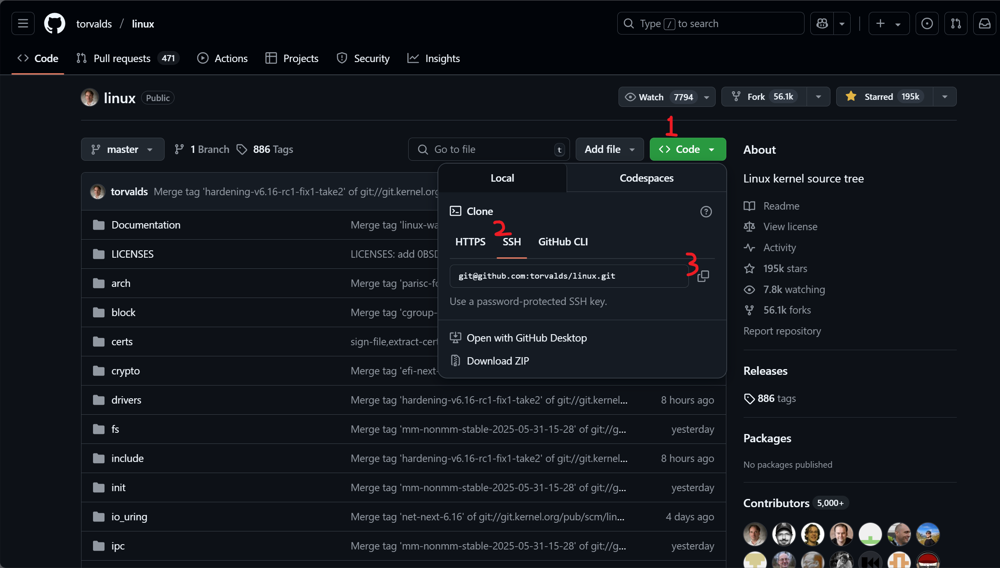
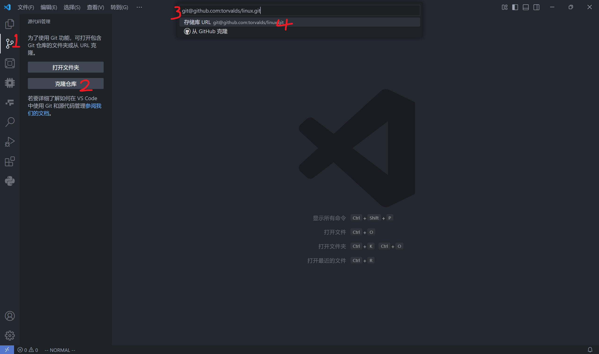
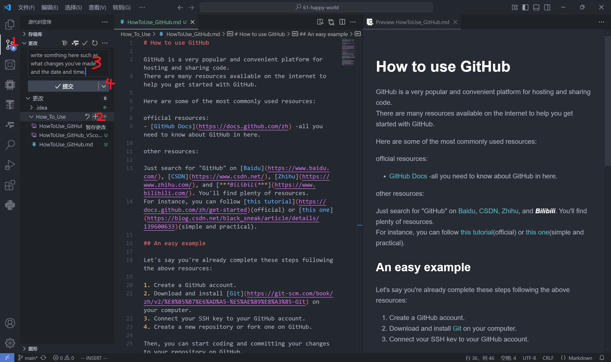
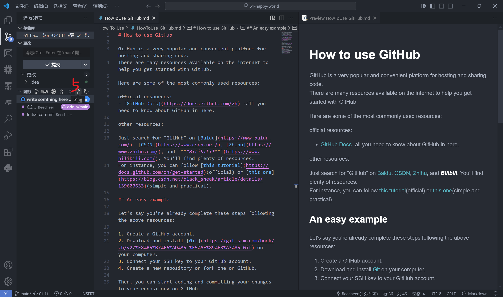
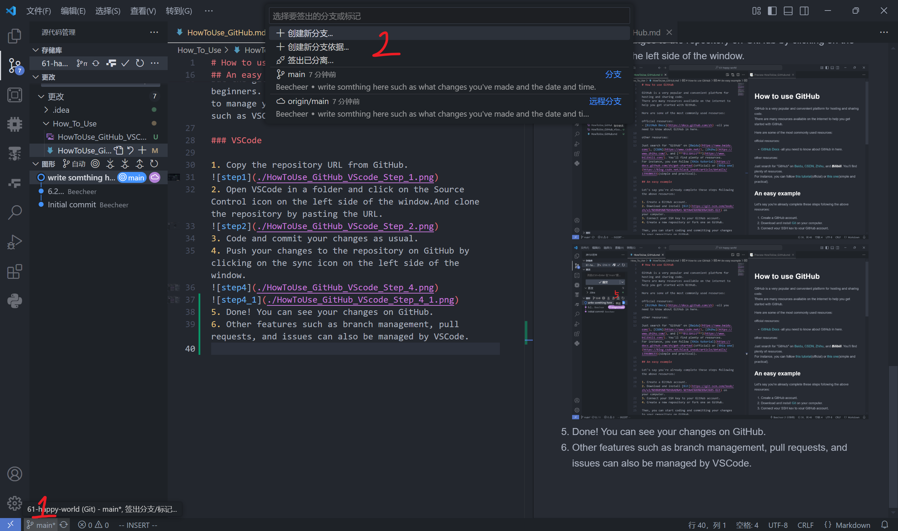
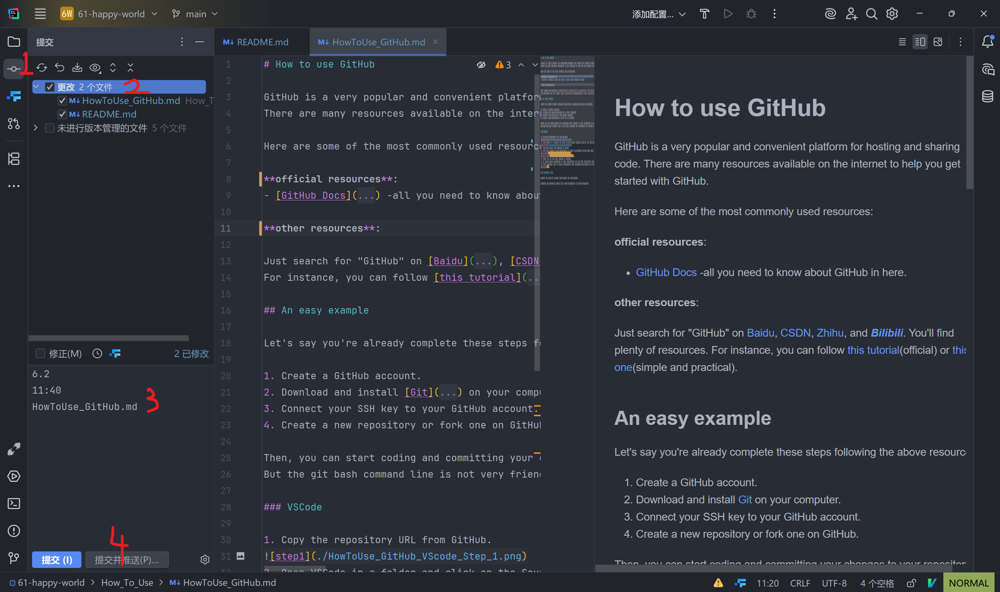

# How to use GitHub

GitHub is a very popular and convenient platform for hosting and sharing code.
There are many resources available on the internet to help you get started with GitHub.

Here are some of the most commonly used resources:  

**official resources**:
- [GitHub Docs](https://docs.github.com/zh) -all you need to know about GitHub in here.

**other resources**:

Just search for "GitHub" on [Baidu](https://www.baidu.com/), [CSDN](https://www.csdn.net/), [Zhihu](https://www.zhihu.com/), and [***Bilibili***](https://www.bilibili.com/). You'll find plenty of resources.
For instance, you can follow [this tutorial](https://docs.github.com/zh/get-started)(official) or [this one](https://blog.csdn.net/black_sneak/article/details/139600633)(simple and practical).

## An easy example

Let's say you're already complete these steps following the above resources:

1. Create a GitHub account.
2. Download and install [Git](https://git-scm.com/book/zh/v2/%E8%B5%B7%E6%AD%A5-%E5%AE%89%E8%A3%85-Git) on your computer.
3. Connect your SSH key to your GitHub account.
4. Create a new repository or fork one on GitHub.

Then, you can start coding and committing your changes to your repository on GitHub.
But the git bash command line is not very friendly for beginners. So, here's a simple example to show you how to manage your repository on GitHub using your **IDE** such as VSCode or JetBrains IDEs:

### VSCode

1. Copy the repository URL from GitHub.

2. Open VSCode in a folder and click on the Source Control icon on the left side of the window.And clone the repository by pasting the URL.

3. Code and commit your changes as usual.
4. Push your changes to the repository on GitHub by clicking on the sync icon on the left side of the window.

5. Done! You can see your changes on GitHub.
6. If other people contribute to your repository, you can also pull their changes by clicking on the sync icon on the left side of the window.
7. Other features such as branch management, pull requests, and issues can also be managed by VSCode.

### JetBrains IDEs

almost the same as VSCode, just follow the same steps.
example on CLion:

---

**Note**: Remember to regularly update your local repository to avoid conflicts.