# 旅游规划&攻略
## （一）青海~【2025年夏季（未实现）：单线青海（西宁—格尔木）】~
**注：** 青藏高原，但青海大多地区海拔不算太高，考虑到首次上高原，以防严重的高原反应；更常见的旅游线路是**青甘大环线**，但是需要自驾（甚至要求熟练驾驶技能和良好车辆状况）和更长的时间，故选择**铁路可达地区+当地一到两日游团**的方式。

### 交通
**西宁**
火车/高铁：西宁站
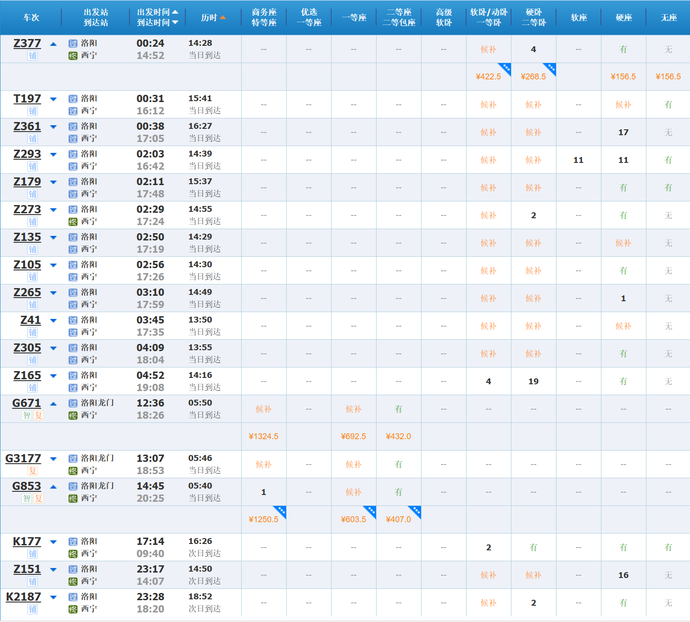
飞机：西宁曹家堡国际机场（XNN）
* 郑州新郑国际机场（直飞/中转）
* 洛阳北郊机场（中转）

西宁-湟源-海晏-乌兰-柯柯-**德令哈**-**格尔木**-不冻泉-沱沱河-安多（西藏）-那曲（西藏）-拉萨（西藏）
西宁-大通西-门源-民乐（甘肃）-张掖（甘肃）
兰州-海东-民和南-西宁

【注意当地Y字头旅游专列&纯数字绿皮车】
* “天空之镜”号旅游列车：
9:00（西宁站）→13:23（茶卡站）；17:50（茶卡站）→22:54（西宁站）；票价为**硬座62.5元**、硬卧110.5元。

### 景点

|景点名称|门票|位置|海拔|开放时间|
|---|---|---|---|---|
|**青海湖二郎剑景区**【5A】|90(45)|海北州（青海湖）|3196m|8:00-17:30|
|~~*金沙湾*~~<不对外开放>|
|日月山|50(27)|西宁市湟源县|3520-4877m|7:00-19:30|
|丹噶尔古城|免费|西宁市湟源县|2690m||
|**茶卡盐湖**|60(30)|海西州乌兰县|3095m|8:00-20:00|
|金银滩原子城|50+60+20+50+20(/2)|海北州海晏县|3210m|8:30-18:00|
|**塔尔寺**【5A】|70(35)|西宁市（郊）|2696m|7:30-17:30|
|~~**可可西里**~~<自驾>|
|~~**昆仑山**~~<自驾>|
|**察尔汗盐湖**|100(80)|格尔木市（郊）|2670m|8:30-18:30|
|乌素特水上雅丹|30(15)|海西州|2700-3260m|8:00-18:00|
|*大柴旦翡翠湖*|50+60|海西州|3148m|9:00-18:00|
|*东台吉乃尔湖*|免费|海西州|2681m|-|
|**茶卡盐湖**|60(30)|海西州乌兰县|3059m|8:00-20:00|
|~~坎布拉[南宗寺]~~<自驾>|无门票|黄南州|2500-3100m|-|
|隆务寺|约20|黄南州同仁市|2509m|8:00-19:00|
|艾肯泉<航拍>|40|海西州茫崖市|3100m|8:00-20:00|
|~~俄博梁雅丹~~<自驾>||海西州茫崖市|
|门源油菜花海【注意开放情况】|60|海北州门源县|2400m(3940m)||
|东关清真大寺|免费|西宁市|-|8:00-18:00|
|青海省博物馆|免费|西宁市|-|9:00-17:00|
|南山公园|免费|西宁市|-+|6:30-20:30|
|青海藏文化博物院|60(30)+0|西宁市|-|9:00-17:30|
|莫家街|免费|西宁市|-|-|
|西宁高原野生动物园|30(15)|西宁市|-|9:00-18:00|
|~~瞿昙寺【开放情况未知】~~|
|~~阿咪东索景区~~<自驾>|54|海北州|2800-3500m|8:30-18:00|
|~~年保玉则~~<不对外开放>||果洛州|
|~~祁连山[卓尔山]~~<自驾>|
<!--|~~敦德冰川~~|-->
<!--|~~当雄冰川~~|-->

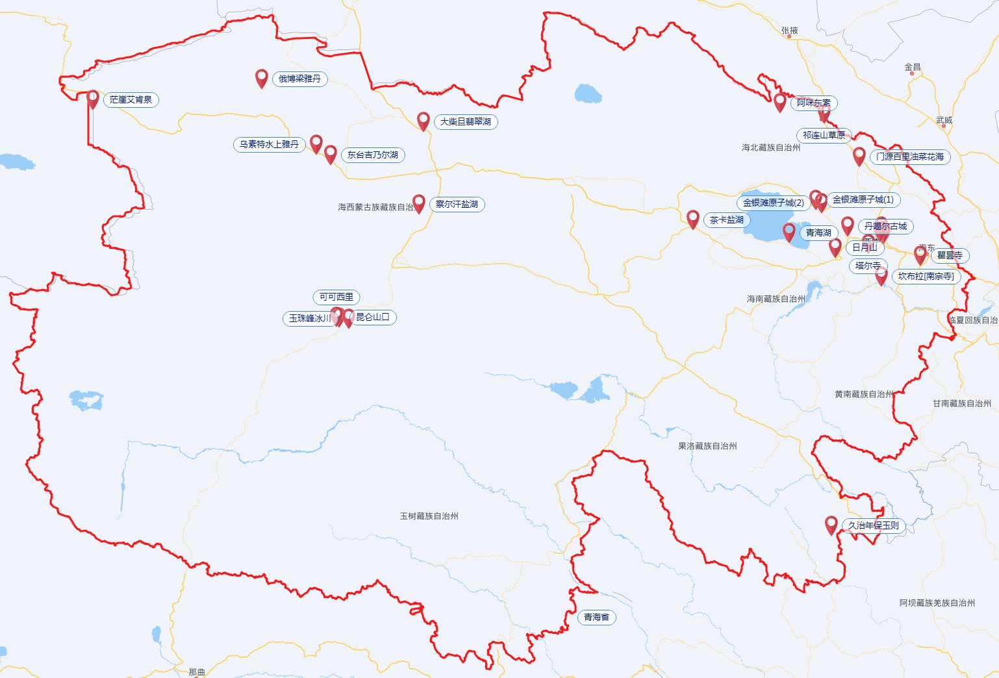

#### 具体行程安排：【咨询一日团】
前往西宁：**K177**（洛阳17:14—西宁09:40）/Z151（洛阳23:11—西宁14:07）/Z377（洛阳00:24—西宁14:52）
【1\~2天~?可调整~】【西宁市区/郊活动】青海省博物馆、东关清真大寺、青海藏文化博物院、南山公园、莫家街、西宁高原野生动物园【半天】、塔尔寺【半天】
【西宁周边1~2天（可能需过夜），行程较紧凑，需包团或包车】日月山、丹噶尔古城、青海湖（二郎剑/黑马河）、金银滩、茶卡盐湖
【一天，需乘坐高铁】门源百里油菜花田
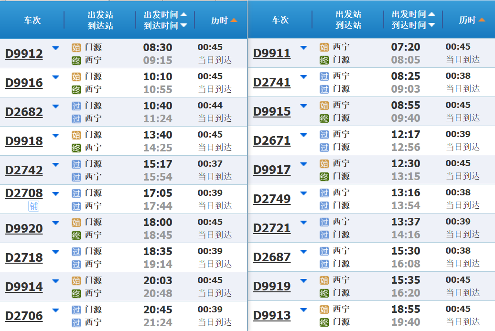
【一天，若行程较宽松】茶卡盐湖<“天空之镜”号旅游列车>
西宁—格尔木【去程前进方向左侧景色较好：青海湖、尕海、托素湖、~~克鲁克湖、察尔汗盐湖~~ ~（右侧）~】：K7601（西宁22:20—格尔木06:30）/~~Z9819（西宁23:15—格尔木05:48；临时，2025年7月12日、15日、18日、21日、24日、27日、30日，8月2日、5日、8日、11日、14日、17日，Z9819次旅客列车从西宁开往至拉萨）~~/K6813（西宁23:45—格尔木07:50）
【格尔木方向1】察尔汗盐湖、乌素特水上雅丹&东台吉乃尔湖~？~、大小柴旦
~~【格尔木方向2】茫崖翡翠湖&艾肯泉（距离过远，沿途经典少，适合自驾进入新疆顺路游览）~~
格尔木—西宁：K7602（格尔木22:50—西宁06:56）
~~格尔木—敦煌：竟然没有直达车次！强烈建议开通旅游专利，途径有大柴旦、小柴旦、苏干湖等景点，还是青甘大环线的关键一环，竟然在这断掉了！~~
西宁⇌兰州：兰新高铁必过，55min-1h40min（动车），车次相当多
（西宁）返回洛阳：G3178（西宁09:30—洛阳龙门15:08）/G854（西宁09:40—洛阳龙门15:47）/K178（西宁11:15—洛阳6:14）/T198（西宁12:24—洛阳05:54）/G674（西宁12:47—洛阳龙门18:34）/Z152（西宁14:15—洛阳06:41）/K2188（西宁19:45—洛阳14:42）/Z274（西宁22:35—洛阳15:10）
（兰州）返回洛阳：同上，必过兰州，车次只多不少。

~青海湖黑马河日出？~

#### 全程路线？
※洛阳—西宁—格尔木—（兰州）—洛阳※ （7天+）
~~※洛阳—（兰州）—西宁—格尔木—西宁—张掖—酒泉［敦煌、玉门］—嘉峪关—（兰州）—洛阳※~~ （14天左右）

### 洗护&药物
* 面霜、身体乳、润唇膏（气候干燥）
* 防晒霜（紫外线强烈，每天必用）
* 感冒&消炎药（气候多变）
* 布洛芬（缓解头痛）
* *晕车药【若晕车】*

#### 高原反应
大多数景区海拔在3000m左右，高反不会非常明显。**西宁市区海拔约2200m**，格尔木市区海拔约2800m。
【注：海拔在2500\~3000m以上开始出现，3500\~4000m以上普遍出现】
**用药：乙酰唑胺、红景天等**
**注意事项：刚抵达高海拔地区至少1~2天内不要剧烈运动、洗澡等**

### 衣物
* 3~4件短袖
* 防晒衣
* 冲锋衣（防寒挡雨）或羽绒服（防寒）
* 短裤+长裤（防晒防寒）
* 遮阳帽、墨镜、防晒口罩等
* 运动鞋
* *洞洞鞋/凉鞋【若前往沙漠】*

### 其它必备物品清点
* 身份证、学生证
* 牙刷、牙膏 （洗面奶、洗发露、沐浴露）
* 充电宝、充电线
* 手机、相机、耳机等电子设备，无人机
* 伞具
* 背包

选带：
耳塞、护颈枕、一次性洁具等

可当地购置：
* 氧气瓶（高反/前往3500m以上地区，如可可西里）
* 方便食品（面包、方便面、自热米饭等）
* 卫生纸、湿巾、垃圾袋等

---
## （二）云南~【2026年冬季：滇南（玉溪、红河、普洱、文山、西双版纳）&昆明】~
**注：** 滇南位处热带、亚热带地区，适合冬季（寒假）出行。

### 交通
火车/高铁：
~~南京南—昆明南；南京—昆明~~
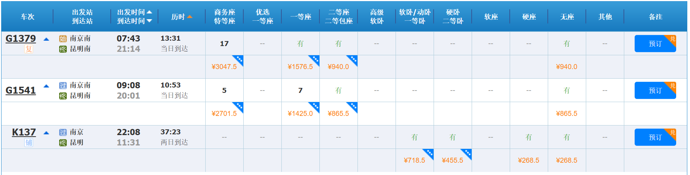
~~昆明南—洛阳龙门~~
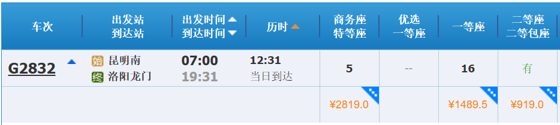
~~昆明—郑州；昆明南—郑州东~~
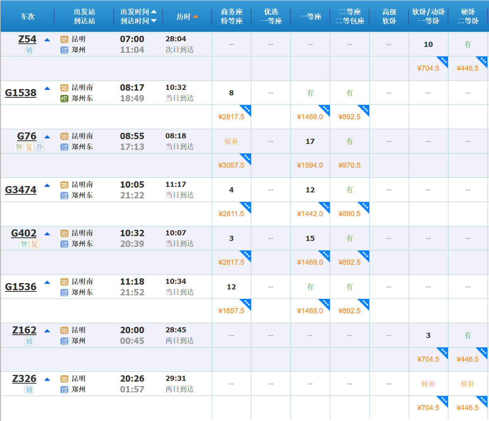
飞机：
* **昆明长水国际机场（KMG）**
南京禄口国际机场（直飞）；郑州新郑国际机场（直飞）；西安咸阳国际机场（直飞）；洛阳北郊机场（直飞~每周二MU9753~/中转）
* 西双版纳嘎洒国际机场（JHG）
南京禄口国际机场（直飞）；郑州新郑国际机场（直飞/中转）；~~洛阳北郊机场（中转）~~
* 丽江三义国际机场（LJG）
南京禄口国际机场（直飞）；郑州新郑国际机场（直飞）
* 大理凤仪机场（DLU）
南京禄口国际机场（直飞/中转）；西安咸阳国际机场（直飞）；郑州新郑国际机场（中转）
* ~~迪庆香格里拉机场~~
* ~~宁蒗泸沽湖机场~~
* ~~文山砚山机场~~
* ~~普洱思茅机场（中转）~~
* ~~澜沧景迈机场（中转）~~

铁路站点：
* 昆明—玉溪—化念—元江—宁洱—普洱—西双版纳—橄榄坝—勐腊—磨憨—［磨丁—孟赛—琅勃拉邦—万荣—万象（老挝）］
* 昆明—禄丰南—广通北—楚雄—南华—云南驿—祥云—大理—鹤庆—丽江—小中甸—香格里拉
* 昆明—玉溪—通海—曲江—建水—个旧—红河—蒙自—屏边—河口北
* 昆明南—石林西—弥勒—竹园—朋普—开远南—红河

### 景点
#### ①昆明市

海拔：1886m（滇池）

|景点名称|门票|开放时间|
|---|---|---|
|**云南省博物馆**【一级】|免费（预约）|09:00-17:00|
|官渡古镇|免费|全天|
||||
|昆明世界园艺博览园~（昆明世博园）~【5A】|0+49(25)|08:30-17:00|
|*金殿风景名胜区*|免费|7:30-18:00|
||||
|国立西南联合大学旧址|
|**翠湖公园**|免费|6:00-23:00|
|~~陆军讲武堂~~<暂未开放>|免费（预约）|9:00-16:00|
|昆明老街［*黄公东街（黄墙）、文林街*］|免费|全天|
|金马碧鸡坊|免费|全天|
|圆通禅寺||
||||
|西山风景名胜区|30|8:30-17:30|
|海埂公园/海埂大坝|免费|全天|
|云南民族博物馆【一级】|免费（预约）|09:00-16:30|
|云南民族村|90(45)|08:30\~17:00；18:00\~22:00|
||||
|**石林风景区**【5A】|130(65)|07:30-18:00|
|大观楼|免费|7:00-19:00|
|昆明市博物馆【一级】|免费（预约）|09:00-17:00|
|~~澄江化石地世界自然遗产博物馆 （云南省自然博物馆）~~<自驾>【一级】|免费（预约）|09:00-17:00|
|~~东川红土地~~<自驾>|免费|全天|
|~~宜良九乡风景区~~<自驾>|60(30)|08:00-18:00|

* **捞渔河湿地**【日落】
* 海洪湿地【划船】
* 双桥夜市【小吃】
* 南强街巷【小吃】
* 斗南花市

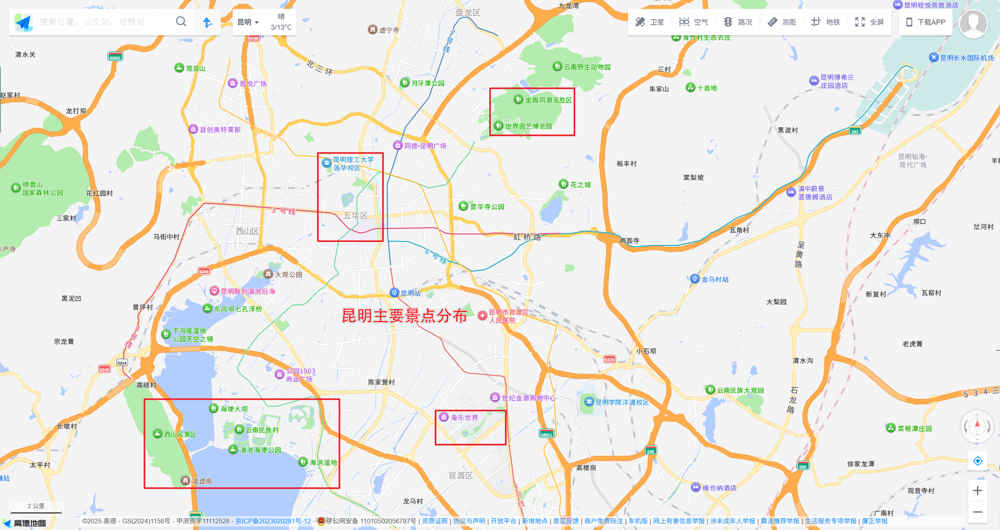

#### ②西双版纳
|景点名称|门票|开放时间|
|---|---|---|
|**曼听御花园**&总佛寺|40(20)|08:00-17:00|
|野象谷|58(30)|08:00-18:00|
|**中科院西双版纳热带植物园**【5A】|80(40)|08:00-18:00|
|西双版纳傣族园|45|全天|
|**望天树景区** 📍勐腊|55(27)/88|8:30-18:00|
|西双版纳原始森林公园|45(22.5)|8:00-18:00|
|基诺山|88~?~|9:00-17:00|
|曼掌村|免费|全天|
|般若寺|免费|8:00-18:00|

> 望天树/基诺山/原始森林公园 三选一

* **星光夜市**
* 景洪农贸市场
* 六国水上市场
* 江边夜市

#### ③红河~?全程游玩可能需自驾~

昆明
↑↓

<b>建水</b>🚆  建水古城、双龙桥 
↓↑ 
<b>元阳</b>  <b>哈尼梯田</b> 
↓↑ 
<b>个旧</b>🚆  地轨缆车、沙甸大清真寺 
↓↑ 
<b>蒙自</b>🚆  碧色寨风景区、南湖公园、尼苏小镇 

↓↑
石林/昆明

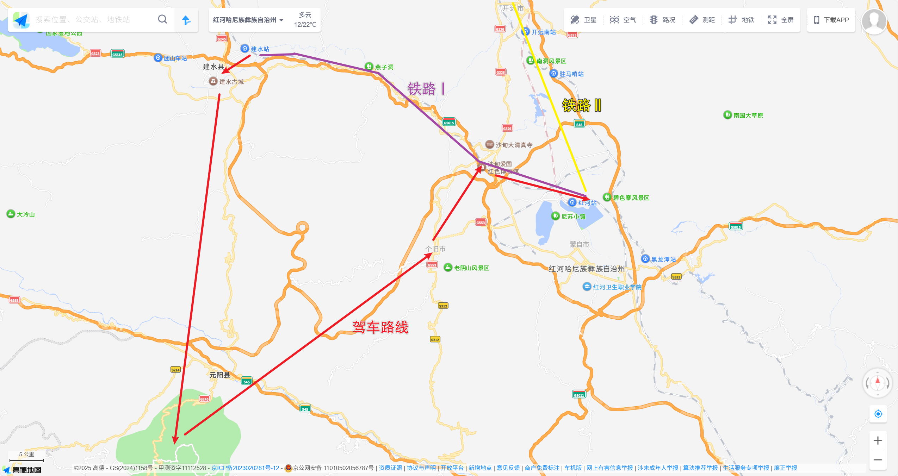

<head></head>
<body>
<b>【以下为补充方案】</b>
</body>

#### ④大理

海拔：1972m（洱海）

|景点名称|门票|开放时间|
|---|---|---|
|**洱海**|免费|全天|
|苍山|35(17)~门票~|8:00-17:00|
|**大理古城**|免费|全天|
|**崇圣寺三塔文化旅游区**【5A】|75(38~?~)|7:30-18:30|
|喜洲古镇|免费|全天|
|~~沙溪古镇~~|免费|全天|

* **龙龛码头**【日出】
* 磻溪S湾
* 廊桥
* 洱海公园
* ~~蝴蝶泉~~
* ~~蛇山公园~~
* ~~双廊&小普陀~~【火车途径，前进方向左侧】

> **苍山相关：**
 洗马潭索道（往返335元）：直达山顶，后有1.5km徒步栈道，可达洗马潭。【海拔：**下站2249m，中站2900m七女龙池，上站3900m洗马潭**】
 ⚠疑似中站暂无法联通玉带路，需慎重考虑。
 感通索道（往返115元）：可达清碧溪，或玉带路到中和索道。【海拔：**下站2260m感通寺，上站2523m清碧溪**】
 中和索道（往返95元）：可达中和寺、玉带路，**开放式索道**。
 最佳路线（**需确认**）：*洗马潭索道*上，游洗马潭和冷杉林；*洗马潭索道*下到中站，游七龙女池，再走4.5km玉带路，*感通索道*下，再到感通寺和寂照庵。

#### ⑤丽江
海拔：2416m（丽江古城）
|景点名称|门票|开放时间|
|---|---|---|
|**丽江古城景区**【5A】 ［木府、狮子山万古楼］|免费|全天|
|束河古镇|免费|全天|
|白沙古镇|免费|全天|
|~~文笔山风景区~~<暂停开放>|免费|
|拉市海湿地|30(15)|9:00-19:00|
|黑龙潭公园|50|7:20-9:00|
|**玉龙雪山景区**【5A】|100|8:30-23:00|
||||
|虎跳峡~?~<*1800m\~*> 〔丽江&迪庆州~香格里拉~〕|45|8:30-17:30|
|泸沽湖~?~<*2685m*> 〔丽江&凉山州〕|70(35)|全天|

> **玉龙雪山相关：**
 《印象·丽江》演出：180元/人 
 　
 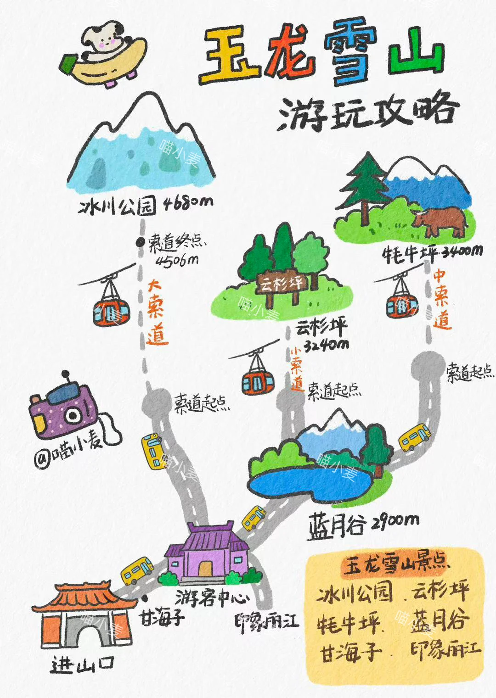
 进山费（门票）：100元
 **冰川公园**-大索道：140元【海拔：上站**4506m**；冰川公园**4680m**】
 云杉坪-小索道：60元【海拔：冰川公园**3240m**】
 牦牛坪-中索道：65元【海拔：牦牛坪**3400m**】
 　
 云杉坪/牦牛坪**二选一**：
 天气晴朗→牦牛坪（早上/下午）；天气一般→云杉坪
 强度&耗时：牦牛坪＞云杉坪
　
 **进出山交通**：
 ➤101路：忠义市场⇌玉龙雪山（甘海子） （15元/人）—首班车7:00，末班车17:00，发车间隔约30min。
 ➤观光火车：玉龙雪山站⇌游客中心 （往返80元/人，单程50元/人，不含门票）

<!--
#### ⑥迪庆~！~
海拔：约3300m（独克宗古城）
-->

### 行程
（A）昆明—西双版纳—大理—**丽江**—昆明
（B）昆明—西双版纳—丽江—**大理**—昆明
（C）昆明—丽江—大理—**西双版纳**—昆明
（D）昆明—大理—丽江—**西双版纳**—昆明
　
昆明→西双版纳：05:58\~19:23→10:36\~22:54 **3\~4h**/4.5h/5h
昆明→大理：06:51\~21:17→09:08\~23:21||*00:29*→*07:20* **2\~2.5h**/7h
昆明→丽江：07:50\~17:27→11:59\~21:59 21:30→07:55（Y752） 00:29→10:28（Y772） **3.5\~4.5h**/10h
> **Y752次 21:30→07:55 双层火车；酒吧餐车**

西双版纳→大理：C9522 10:45→16:48 6h　　C4310 08:08→14:26 6h　　Y772 19:00→10:28 15.5h
西双版纳→丽江：C394 10:22→18:31 8h　　Y772 19:00→10:28 15.5h
大理→丽江：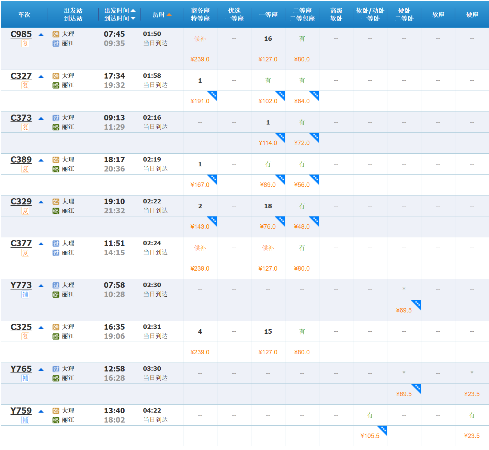
丽江→大理：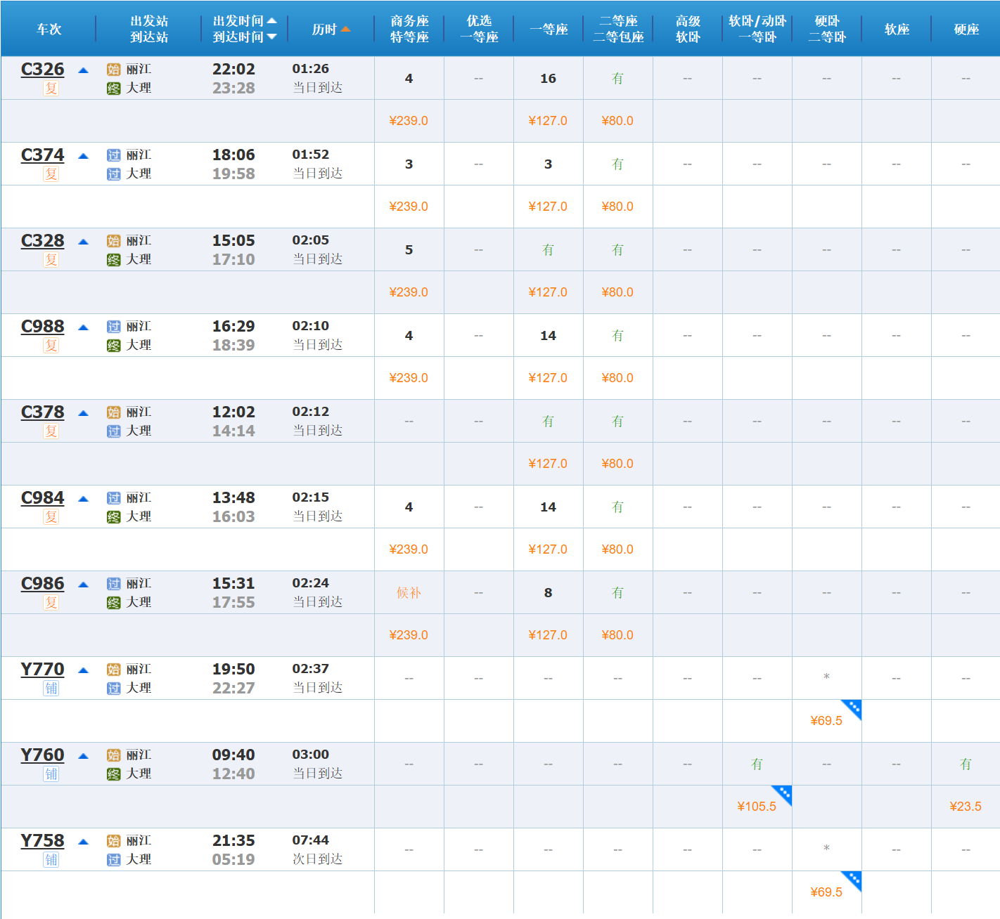
丽江→西双版纳：C396 09:10→17:55 8.5h　　Y770 19:50→11:00 15h
大理→西双版纳：C9524 16:43→22:42 6h　　Y770 22:52→11:00 15.5h
丽江→昆明：08:10\~20:10→12:03\~23:57 20:40→05:06（Y754） 19:50→05:24（Y770） 21:35→08:35（Y758） **3.5\~4.5h**/9.5h~11h
大理→昆明：07:03\~21:26→09:26\~23:50||*22:52*→*06:21*||*5:50*→*08:35* **2\~2.5h**/7.5h/3h
西双版纳→昆明：07:00\~19:35→10:34\~23:36||*19:00*→*00:17* **3\~4h**/5h

### 洗护&药物
* **高反药物**：乙酰唑胺、红景天等
* 防晒霜【大理&丽江&西双版纳】
* 感冒药
* 止痛药（布洛芬等）
* 肠胃药
* 创可贴等
* *晕车药【若晕车】*
**注意事项：刚抵达高海拔地区至少1~2天内不要剧烈运动、洗澡等**
【注：高原反应在海拔2500\~3000m以上开始出现，3500\~4000m以上普遍出现】

### 衣物
* 较薄长袖长裤【西双版纳】
* 防晒衣【大理&丽江&西双版纳】
* 冲锋衣（防寒挡雨）或羽绒服（防寒）
* 较厚长裤【大理&丽江】
* 遮阳帽、墨镜等
* 运动鞋

### 其它必备物品清点
* 身份证、学生证
* 牙刷、牙膏 （洗面奶、洗发露、沐浴露）
* 充电宝、充电线
* 手机、相机、耳机等电子设备
* 伞具
* 背包

选带：
耳塞、护颈枕、一次性洁具等

可当地购置：
* 氧气瓶【大理 苍山；丽江 玉龙雪山】
* 方便食品（面包、方便面、自热米饭等）
* 卫生纸、湿巾、垃圾袋等

<!--
云南（2nd）
腾冲市 **和顺古镇景区**【5A】
保山市 **火山热海旅游区**【5A】
迪庆州 **普达措国家公园**【5A】
文山州：**普者黑**【5A】、舍得草场、老君山、西华公园、文笔塔、坝美村
-->

---
## （三）山西~【2026年夏季：山西】~

---
## （四）新疆

---
## （五）广东&香港&澳门

---
## （六）日本~？！~
* 关东线：东京-神奈川-富士山
* 关西线：京都-大阪-神户
* 北海道线：札幌-函馆-青森
* 冲绳线：那霸-宫古-石垣
