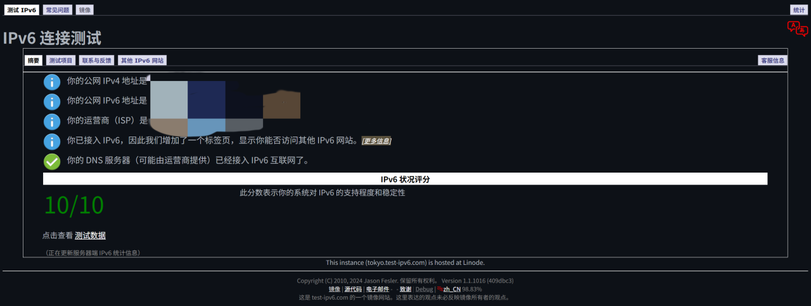
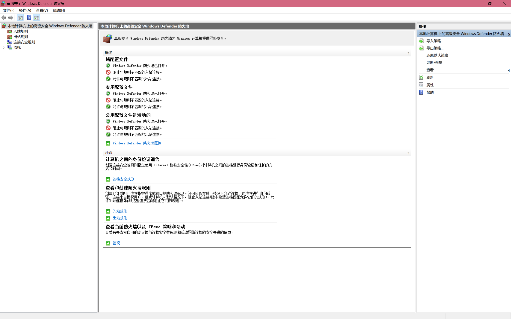

# 更好的 Minecraft 多人游戏：公网IPv6远程直连

## Before：在开始之前...

* ### IPv6

  IPv6是新一代的网络协议。对比现行的IPv4协议，IPv6的地址数更多，达到了约3.4×10^38个，这使得网络运营商可以把IP地址一一对应地分配到各家各户。

* ### IPv6能干什么？

  首先你需要理解网络连接的建立过程。一般来说，计算机通信与流量转发依赖“端口”（Port），它是保障你的数据会传输到正确的计算机的“通行证”。

  既然每台设备独有一个公网IPv6地址，我们就可以通过IPv6地址来唯一定位一台设备了。由此，我们就可以实现与固定设备的远程连接。

## Deeper：我们需要更深入些

* ### 主机

  要使用IPv6联机，很显然你得有IPv6。访问合适的IPv6测试网站，比如[IPv6 Test](https://test-ipv6.com)，你可以得知你的网络是否拥有一个公网IPv6地址。

  如果你获得了像这样的页面，那么恭喜你，你拥有一个公网IPv6地址！

  

  当然，仅仅拥有是不够的，我们需要学会使用。

  * 以下操作暂时限定为Windows系统，如果未来谁有空的话可以补上Linux或macOS版本的

  开启终端工具，运行如下指令：

  ```shell
  # 获取本机网络信息
  ipconfig
  ```
  
  寻找到你当前的网络连接方式（无线/有线）下的结果。

  其中，我们关注`IPv6 地址`和`临时 IPv6 地址`两条。将其中以`240*`或`2001`起头，而非`fd**`或`fe**`起头的几个复制到合适的地方保存下来，一会会用到。

  通常来讲，你刚刚复制的地址中会有一个与IPv6测试网站的测试结果相同。由于`临时 IPv6 地址`会经常变化，本手册之后提到主机的IPv6地址时，建议优先选用`IPv6 地址`。

  当然，为了你的电脑的安全着想，外部的网络请求要想进入，需要你的放行许可。

  打开控制面板，找到系统和安全 -> Windows防火墙 -> 高级设置，你会看到这样的画面：

  

  在入站和出站规则中都新建一条规则，选择端口 -> TCP 放行特定端口25565 -> 剩余保持默认，并命名为MC（或者其他你能记住的名字）

  现在你可以打开你的MC了。

  在单人模式游玩地图时，选择`对局域网开放`，本地端口填写`25565`，接着就可以等着别人进来了。

* ### 客机

  在主机完成了配置后，寻找另一台电脑，确保电脑本身网络连接启用了IPv6。（若无，可在控制面板的网络相关选项中寻找相关配置并开启）

  然后开启终端工具，运行如下指令：

  ```shell
  # 向主机进行Ping操作以测试连通性
  ping -6 [主机的IPv6地址]
  ```
  示例输出：
  ```text
  正在 Ping [主机的IPv6地址] 具有 32 字节的数据:
  来自 [主机的IPv6地址] 的回复: 时间=*ms
  来自 [主机的IPv6地址] 的回复: 时间=*ms
  来自 [主机的IPv6地址] 的回复: 时间=*ms
  来自 [主机的IPv6地址] 的回复: 时间=*ms

  [主机的IPv6地址] 的 Ping 统计信息:
  数据包: 已发送 = 4，已接收 = 4，丢失 = 0 (0% 丢失)，
  往返行程的估计时间(以毫秒为单位):
  最短 = *ms，最长 = *ms，平均 = *ms
  ```
  则证明连通性正常。若延迟较高，建议检查双端网络连接状况，或者多试几次。

  接着，你可以打开和主机相同版本的MC，保证主机的游戏已开放至局域网，然后在多人游戏 -> 直接连接 中输入：

  ```text
  # 注意：这里的方括号是需要加上的
  [主机的IPv6地址]:25565
  ```
  
  点击连接。然后你就可以和主机一起游戏啦！

  顺带一提，为了方便，你也可以将这个地址添加为服务器，以免每次都要复制粘贴。

## Setbacks：可能出现的问题
* TODO: 在写了在写了

## Fable：传
  Varecia在花了三天搞明白了联机之后，0个群友在意。
  
  爷的世界确有问题！（bushi